# Zoom → YouTube 自動転送ツール

Zoomのクラウド録画を、指定した期間まとめてYouTubeへ自動アップロードするGoogle Colabノートブックです。

## 特徴

- **完全無料** — Google Colab・Zoom・YouTubeの無料枠内で動作
- **Googleドライブの容量を消費しない** — アップロード完了後に一時ファイルを自動削除
- **ノーコード** — フォームに入力してボタンを押すだけで転送完了
- **セキュア** — APIキーはあなた自身のGoogleアカウント内にのみ保存

---

## 使い方

### 1. ノートブックをColabで開く

開いた際に「このノートブックはGoogleが作成したものではありません」と表示されたら、「**このまま実行**」をクリックしてください。

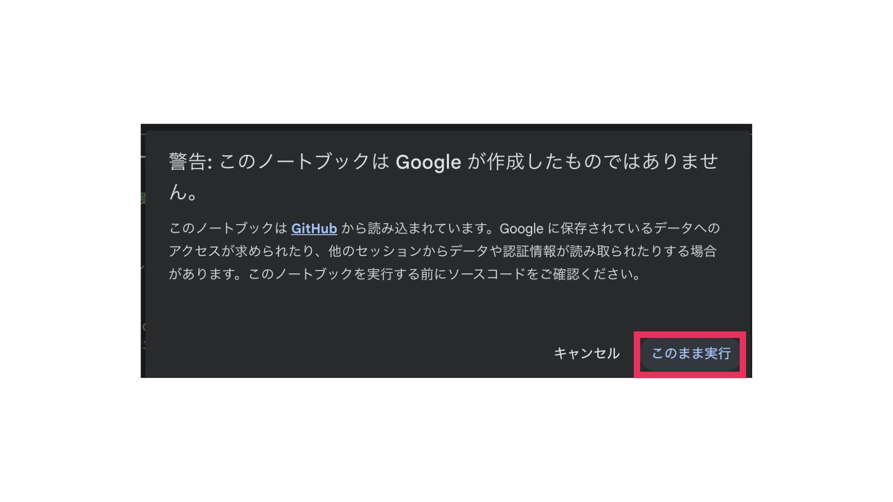

---

### 2. Zoom API の設定（初回のみ）

#### STEP 1 — Zoom App Marketplace にアクセス

1. [Zoom App Marketplace](https://marketplace.zoom.us/) を開いてログインする
2. 右上の「**Develop**」をクリック
3. 「**Build App**」をクリック

---

#### STEP 2 — Server-to-Server OAuth を選択

アプリの種類一覧が表示されます。「**Server-to-Server OAuth**」の「**Create**」をクリックします。

アプリ名の入力を求められます。何でも構いません（例：`MyZoomTransfer`）。入力したら「**Continue**」をクリックします。

---

#### STEP 3 — 認証情報を確認・コピー

「**App Credentials**」タブを開きます。以下の3つが表示されているのでコピーしておきます（後でColabに入力します）。

- **Account ID**
- **Client ID**
- **Client Secret**（「Show」をクリックすると表示されます）

> ⚠️ これらの値は他人に見せないようにしてください。

---

#### STEP 4 — 権限（Scope）を追加

1. 「**Scopes**」タブをクリック
2. 検索欄に `list` と入力
3. 以下のスコープを見つけてチェックを入れる

| 項目 | 内容 |
|---|---|
| **スコープ名** | `cloud_recording:read:list_user_recordings:admin` |
| **説明** | ユーザーのすべてのクラウドレコーディングを一覧表示する。 |

---

#### STEP 4b — アプリを有効化（Activation）

「**Activation**」タブを開くと入力欄が2つあります。

| 項目 | 入力内容 |
|---|---|
| **Short Description** | `Zoom recordings transfer tool`（何でも可） |
| **Company Name** | 自分の名前など（例：`Kenta`）（何でも可） |

入力したら「**Activate**」をクリックして完了です。

---

#### STEP 5 — Colabのシークレットに登録

1. [Google Colab](https://colab.research.google.com/) を開く
2. 左メニューの **🔑 鍵アイコン**をクリックし、「**＋ 新しいシークレットを追加**」をクリック

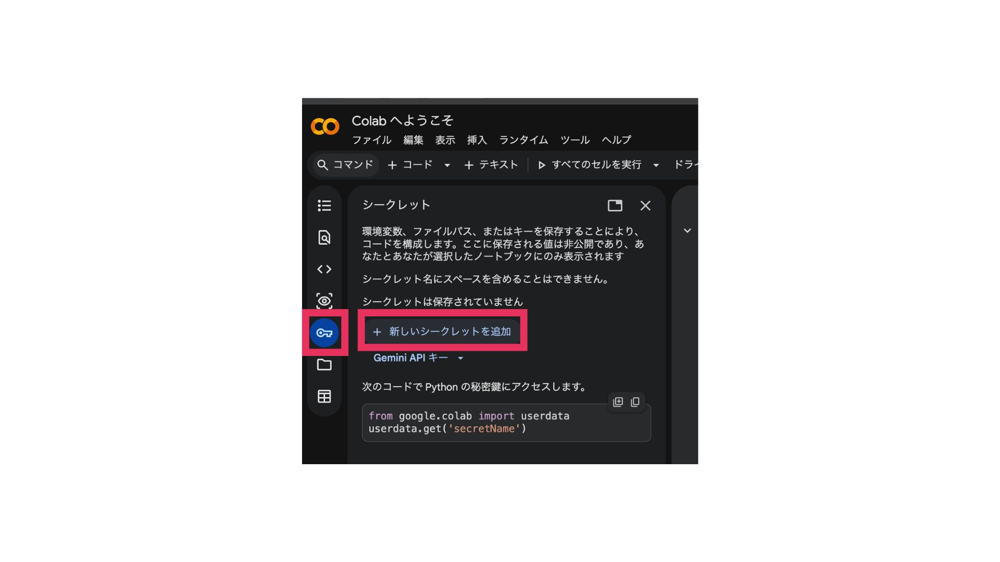

3. 以下の3つを登録する

| 名前（正確に入力してください） | 値 |
|---|---|
| `ZOOM_ACCOUNT_ID` | STEP 3 でコピーした Account ID |
| `ZOOM_CLIENT_ID` | STEP 3 でコピーした Client ID |
| `ZOOM_CLIENT_SECRET` | STEP 3 でコピーした Client Secret |

> 💡 「ノートブックからのアクセス」のトグルをオンにしておいてください。

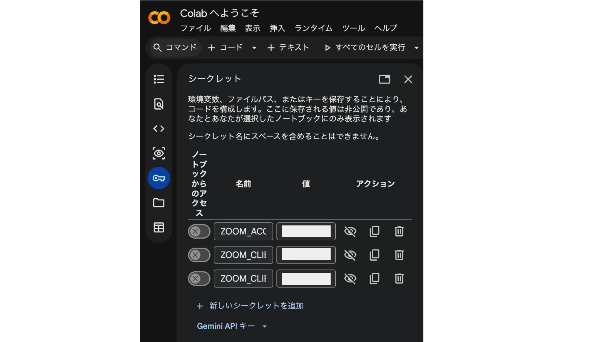

---

### 3. YouTube API の設定（初回のみ）

#### STEP 6 — Google Cloudでプロジェクトを作成

1. [Google Cloud Console](https://console.cloud.google.com/) を開く
2. 画面左上の **Google Cloud ロゴの右隣** にある「プロジェクトを選択」をクリック

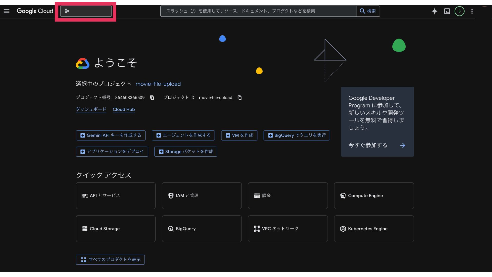

3. ポップアップ右上の「**新しいプロジェクト**」をクリック

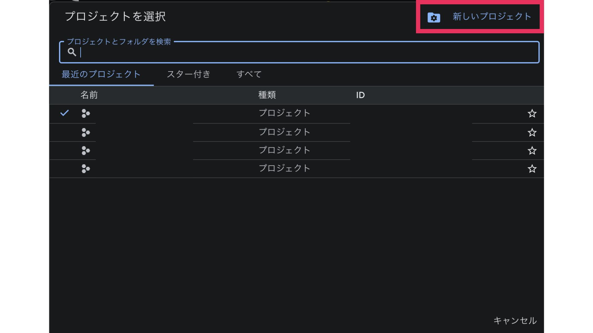

4. 以下のように入力する

| 項目 | 入力内容 |
|---|---|
| **プロジェクト名** | `ZoomYouTubeTransfer`（何でも可） |
| **プロジェクトID** | 自動で入力される。**変更不要** |
| **親リソース** | 「組織なし」のまま。**変更不要** |

5. 「**作成**」をクリック

---

#### STEP 7 — YouTube Data API v3 を有効化

1. 左メニューの「**APIとサービス**」→「**ライブラリ**」をクリック

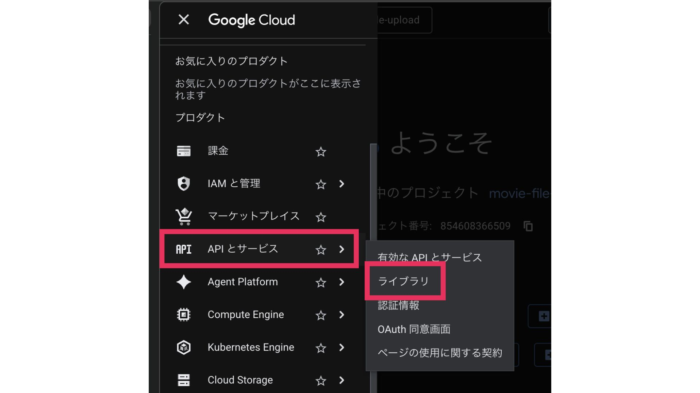

2. 検索欄に `YouTube Data API` と入力し、候補をクリック

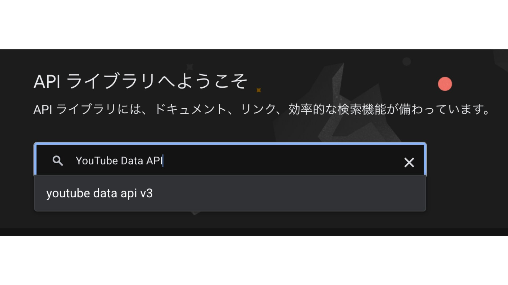

3. 「**YouTube Data API v3**」をクリック

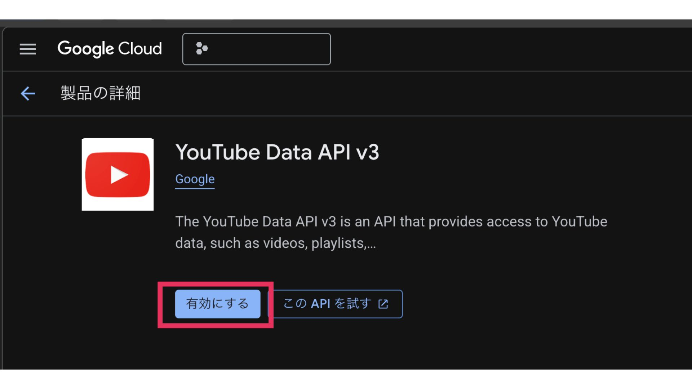

4. 「**有効にする**」をクリック

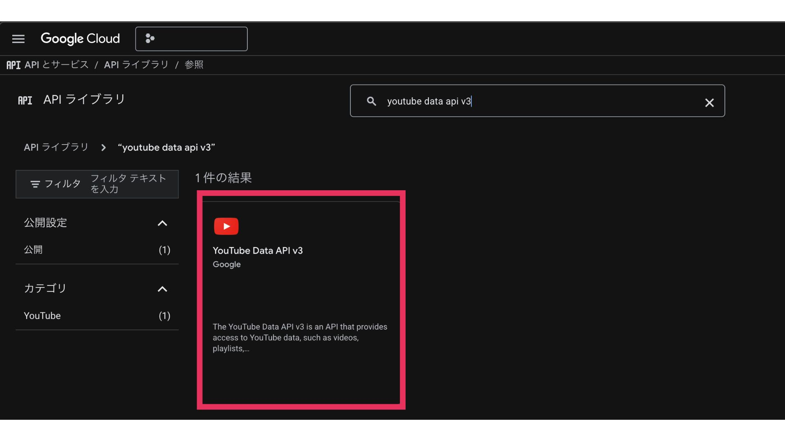

---

#### STEP 8 — OAuthクライアントIDを作成

1. 左メニューの「**APIとサービス**」→「**認証情報**」をクリック
2. 「**認証情報を作成**」をクリック

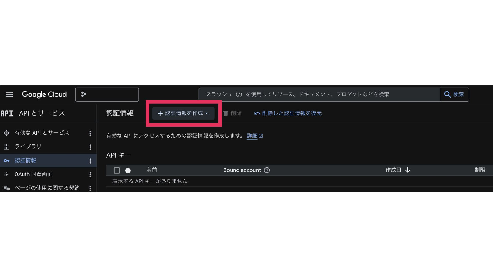

> ⚠️ 「**OAuth同意画面を先に構成してください**」と表示された場合
> 1. 「**同意画面を構成**」をクリック
> 2. 「**外部**」を選んで「**作成**」
> 3. 以下の項目だけ入力。それ以外は**入力不要**
>    - **アプリ名**：何でも可（例：`ZoomYouTubeTransfer`）
>    - **ユーザーサポートメール**：自分のメールアドレス
>    - **デベロッパーの連絡先メールアドレス**：自分のメールアドレス
> 4. 「**テストユーザー**」の欄に、YouTubeアップロード先のGoogleアカウントのメールアドレスを追加する
> 5. 「**保存して次へ**」を何度かクリックして最後に「**ダッシュボードに戻る**」
> 6. 手順1からやり直す

3. 「**OAuthクライアントID**」をクリックし、以下のように入力する

| 項目 | 入力内容 |
|---|---|
| **アプリケーションの種類** | 「**デスクトップアプリ**」を選択 |
| **名前** | 自分が管理しやすい名前（例：`ZoomYouTubeTransfer`）。何でも可 |

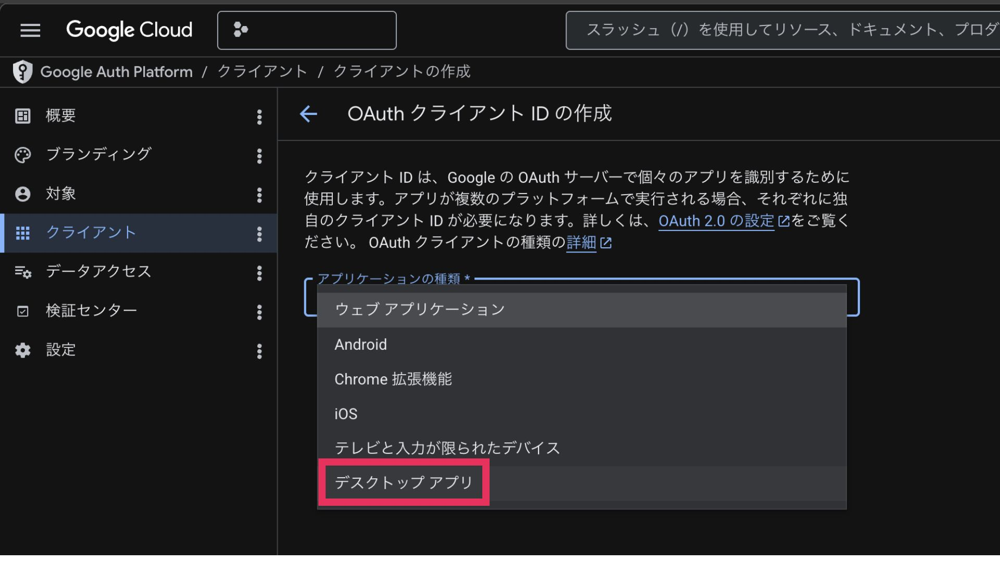

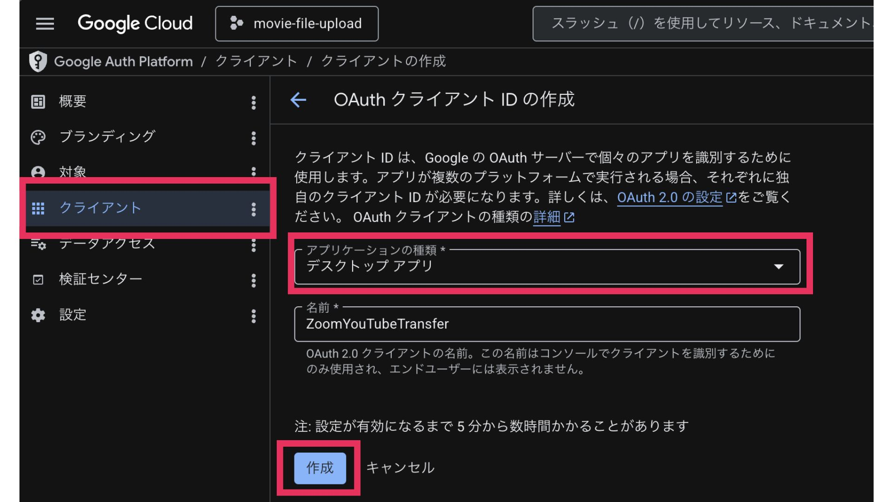

4. 「**作成**」をクリック
5. 完了画面が出たら「**JSONをダウンロード**」をクリック → `client_secrets.json` が保存される

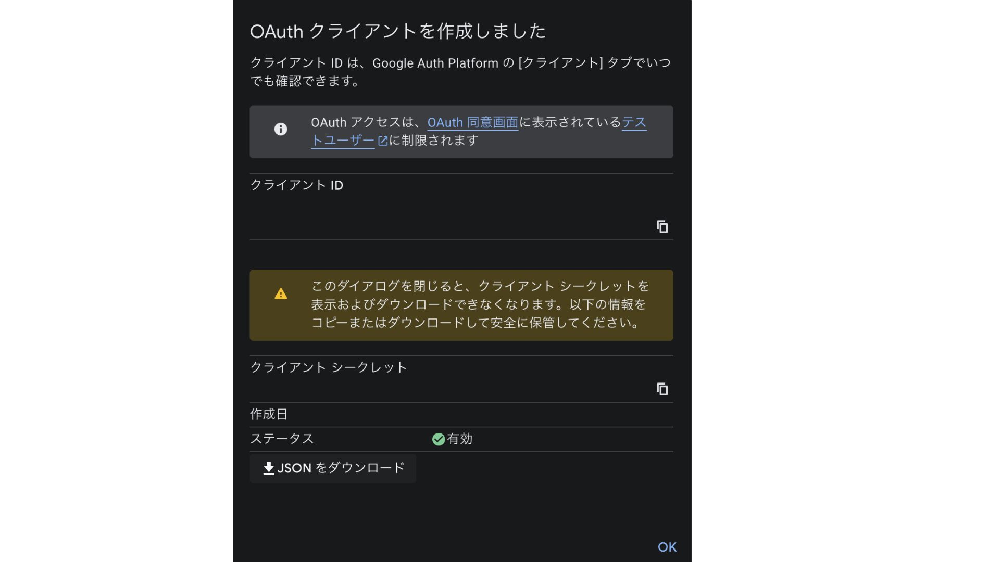

---

### 4. ノートブックを実行

> ⚠️ **必ず上から順番に実行してください。** 順番を飛ばすとエラーになります。

**① `③ セットアップ` を実行**
▶ を押す → 「✅ 準備が整いました」と表示されればOK

**② `④ 転送設定` を入力・実行**
実行間隔・公開設定・タイトルを確認し、▶ を押す → 「✅ 設定完了！」と表示されればOK

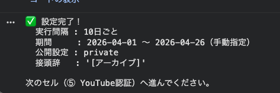

**③ `⑤ YouTube認証` を実行**

1. ▶ を押すと `client_secrets.json` のアップロードを求められる → STEP 8 でダウンロードしたファイルを「**ファイル選択**」で選ぶ

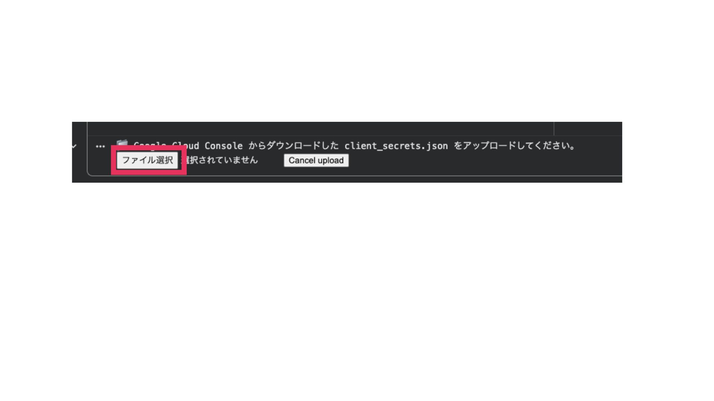

2. 「ノートブックにシークレットへのアクセス権がありません」と表示されたら「**アクセスを許可**」をクリック

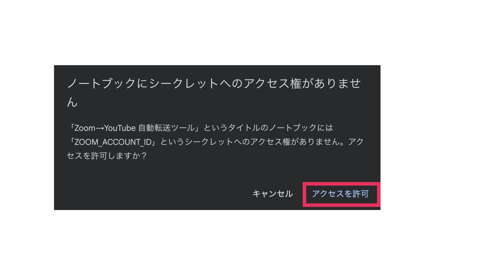

3. YouTube認証URLが表示される → コピーしてブラウザで開く
4. Googleアカウントでログインし「**続行**」をクリック

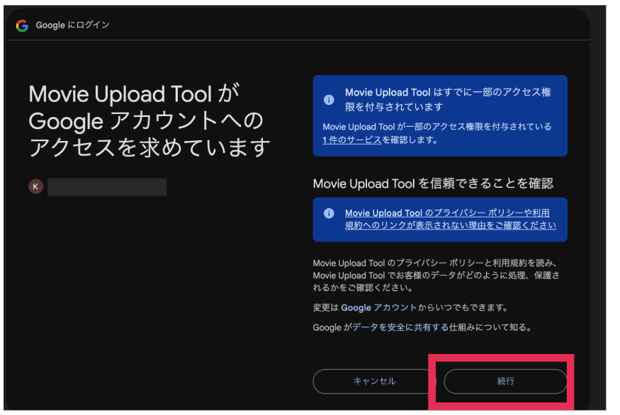

5. 「このアプリはGoogleで確認されていません」と表示されたら「**続行**」をクリック

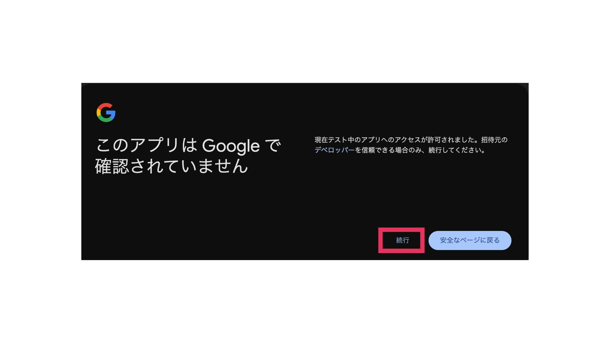

6. ブラウザに「**このサイトにアクセスできません**」と表示される → **これは正常です ✅**

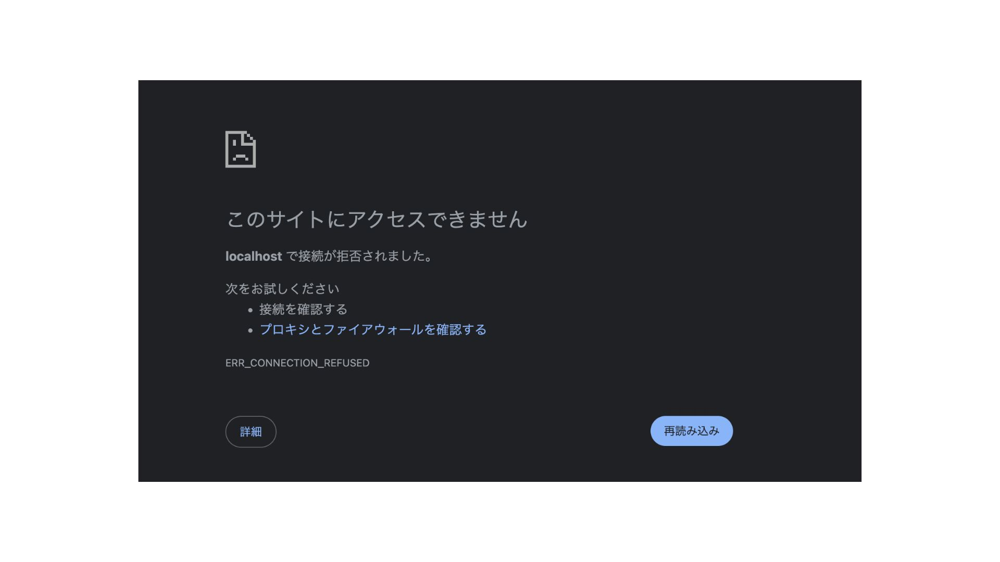

7. アドレスバーの `http://localhost/?code=...` から始まる長いURLをまるごとコピー
8. Colabの「リダイレクト後のURL:」の入力欄に貼り付けてEnterを押す
9. 「✅ YouTube認証が完了しました！」と表示されればOK

**④ `⑥ 転送実行` を実行**
▶ を押す → 転送が自動で始まります

---

## 制限事項

| 項目 | 制限 |
|------|------|
| YouTube APIの1日あたり上限 | 約6件（10,000ユニット/日） |
| 動画の長さ | 15分以上は事前に[電話番号認証](https://www.youtube.com/verify)が必要 |
| ファイル形式 | MP4のみ対応（Zoomのクラウド録画はMP4で保存されます） |

---

## セキュリティについて

- `client_secrets.json` や `*.pkl`（認証トークン）は `.gitignore` で除外されており、リポジトリにはアップロードされません
- ColabのシークレットはGoogleアカウントに紐付けられており、他者から参照できません

---

## ライセンス

MIT
